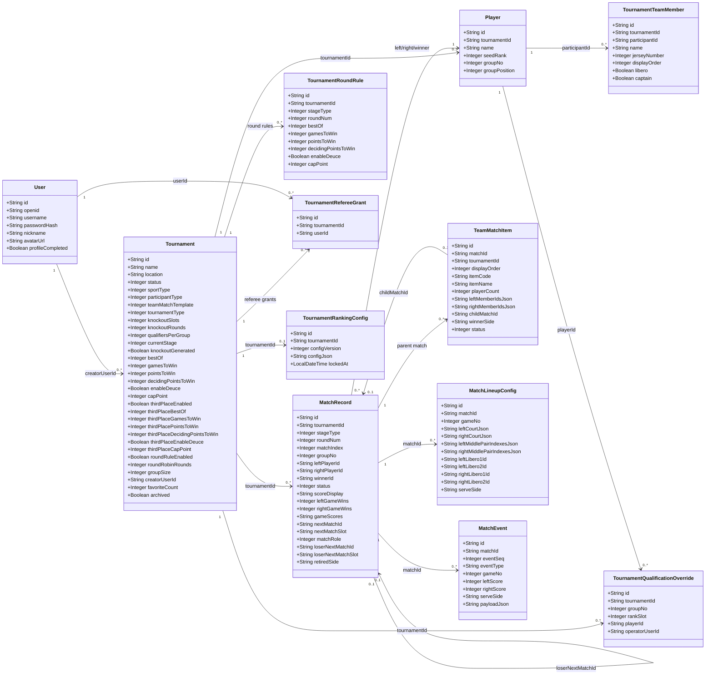
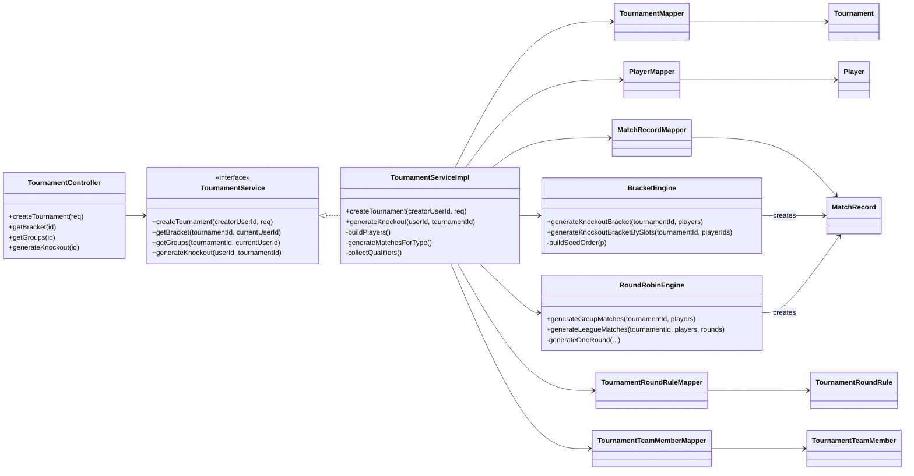
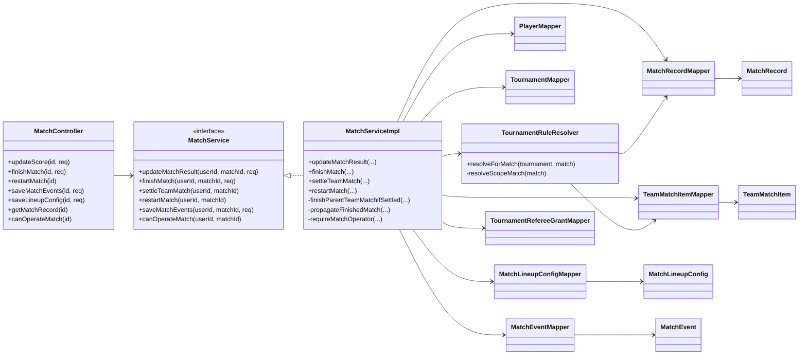
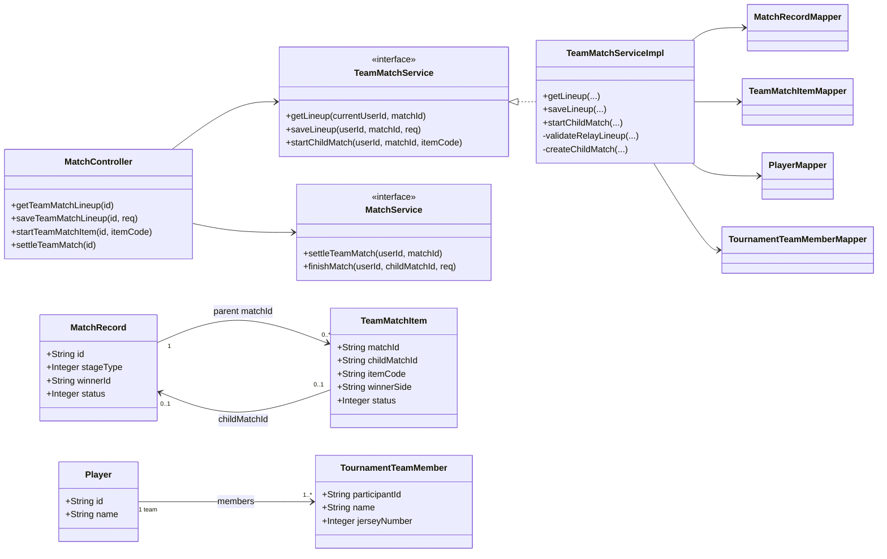
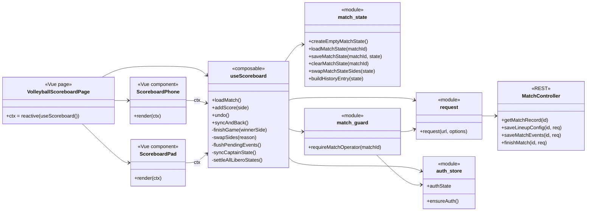
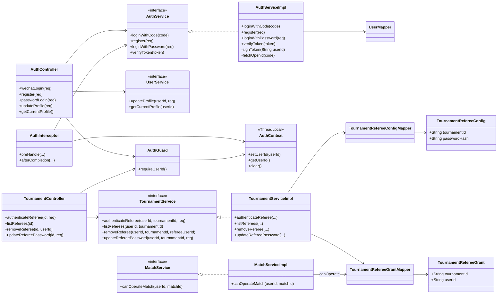
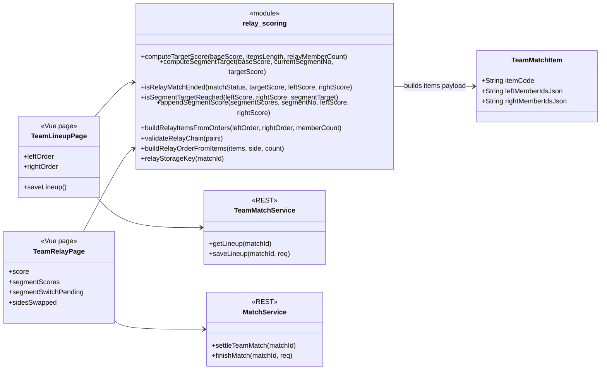
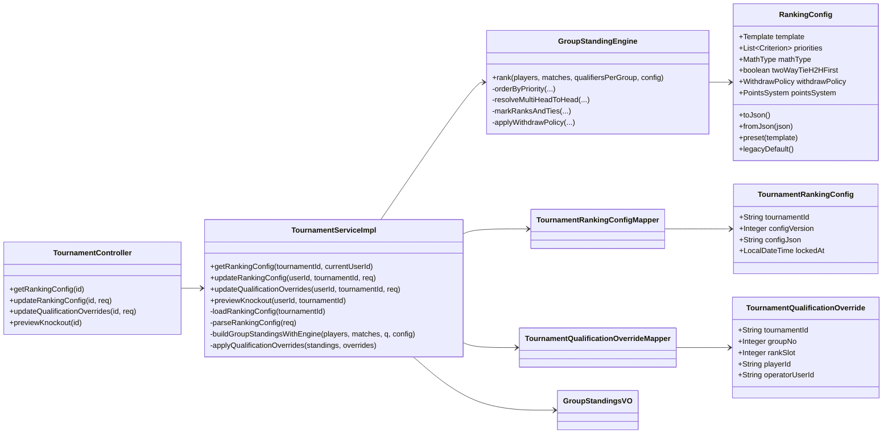
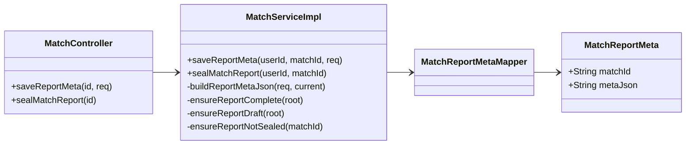

# 核心类图

> 本文只画核心功能模块，不做全量类图。DTO、VO、Mapper 只在影响模块关系时出现。

## 1. 核心领域模型

## 2. 赛事创建与赛程生成

## 3. 比赛记分与结算

## 4. 团体赛与子比赛

## 5. 排球记分前端状态协作

## 6. 鉴权与裁判权限

## 7. 接力追分前端纯逻辑

## 8. 小组排名与晋级资格覆盖

## 9. 战报签章

