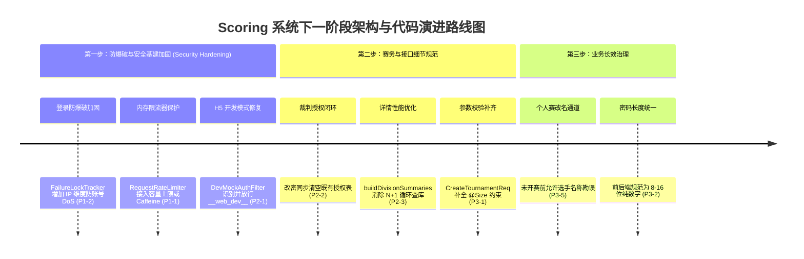

# 全链路地毯式代码审查与潜在问题清单

> **首次审查日期**：2026-09-28 17:30  
> **第二轮复核与状态同步**：2026-09-28 22:00（本轮 9 项核心修复已落地并通过全量回归）  
> **第三轮可用性与业务修复**：2026-09-28 23:50（5 项实用性业务与边界缺陷已落地并全量通过）  
> **审查基准**：在排球状态机核心比分与撤销逻辑已通过数千场混沌测试（Chaos Tests）且双端测试全部通过的前提下，面向全系统进行**无盲区、全链路地毯式排查与严谨复核**。  
> **当前回归状态**：
> - **后端**：393 测试全部通过（`0 Failures, 0 Errors, 5 Skipped`）；
> - **前端**：22 个测试套件、356 个用例全部通过（含混沌与 Fuzzer 仿真）；
> - **打包**：Admin Web Vite 构建 0 错误；前端 H5 编译 0 错误。

---

## 目录
1. [本轮 9 项修复验收与复核报告](#1-本轮-9-项修复验收与复核报告)
2. [最新遗留潜在问题清单（分级汇总）](#2-最新遗留潜在问题清单分级汇总)
   - 2.1 [P1 级（高危架构与防爆破隐患，建议优先加固）](#21-p1-级高危架构与防爆破隐患建议优先加固)
   - 2.2 [P2 级（中危安全、体验与性能隐患）](#22-p2-级中危安全体验与性能隐患)
   - 2.3 [P3 级（低危边界规范与技术债务）](#23-p3-级低危边界规范与技术债务)
3. [六大业务链路最新全景分析](#3-六大业务链路最新全景分析)
4. [面向下一阶段的建议实施路线图](#4-面向下一阶段的建议实施路线图)

---

## 1. 本轮 9 项修复验收与复核报告

本轮开发人员完成了对首轮审查中关键缺陷的高效修复，经过第二轮深入源码级审查与测试实证，复核结论如下：

| 编号 | 修复项 | 涉及文件 | 修复机制与实证结论 | 状态 |
|:---|:---|:---|:---|:---:|
| **FIX-1** | **弃权结算放宽（真实场景防崩）** | `MatchSettlementService.java:731-775` | 引入 `retired` 分支：局数一致性（size）与逐局统计放宽为上界约束；胜方记满 `gamesToWin` 契约保留。解决了打完 ≥1 局弃权时 400 崩溃的真实缺陷。测试 `MatchFinishIntegrationTest` 转正用例全绿。 | ✅ **验收通过** |
| **FIX-2** | **轮空场重开拦截** | `MatchSettlementService.java:473-478` | 已完结场次（status∈{2,3}）若单侧参赛者缺失直接拒绝重开（抛 400 "轮空场次不支持重开"），消除了整棵淘汰赛树缺人死锁的 API 盲区。 | ✅ **验收通过** |
| **FIX-3** | **淘汰赛引擎单槽位断言** | `BracketEngine.java:44, 184` | `generateKnockoutBracket` 前置 `n>=2`，`generateKnockoutBracketBySlots` 前置 `p>=2` 断言，消除了 `rounds.get(-1)` 越界 500 崩溃。 | ✅ **验收通过** |
| **FIX-4a** | **统一父子锁序（消灭 AB-BA 死锁）** | `MatchSettlementService.java:119-123` | 入口先无锁探查 `findTeamChildItem`，子场完赛先锁父场再锁子场；全局锁序统一为：**父场 → 子场 → items**，消除了父场重开与子场完赛并发时的交叉死锁。 | ✅ **验收通过** |
| **FIX-4b** | **子项状态锁定读（消灭快照读漏结算）** | `TeamMatchItemMapper.java`, `MatchSettlementService.java:422` | `countTeamMatchScore` 改用 `@Select("... FOR UPDATE")` 锁定读，消除了 MySQL RR 快照读无法感知并发子场已完赛导致父场停滞的致命问题。两线程并发完赛集成测试绿。 | ✅ **验收通过** |
| **FIX-5** | **列表查询防刷上限（LIMIT 200）** | `TournamentServiceImpl.java:199, 250, 275, 288` | 搜索、收藏、创建、归档四个列表 SQL 统一加入 `LIMIT 200` 兜底截断，消除了 `LIKE '%kw%'` 双通配在大数据量下全表直出与内存撑满风险。 | ✅ **验收通过** |
| **FIX-6** | **多组别列表 VO 与赛制展示解耦** | `TournamentListVO.java`, `TournamentServiceImpl.java:1018`, 前端卡片/表格 | 列表出参由实体改造为 `TournamentListVO`，单次 IN 查询聚合各组别数（消除了 N+1）；前端卡片在多组别时明确展示“N 个组别”，消除了第 1 组别赛制偏见。 | ✅ **验收通过** |
| **FIX-7** | **队伍编辑完赛状态闸门** | `TournamentTeamEditService.java:59-66` | 完赛状态（status==2）时仅放行修改队名，严格拦截增加队员与修改姓名/号码，守住了完赛后 roster 语义漂移的底线。 | ✅ **验收通过** |
| **FIX-8** | **签名导出 JPEG 压缩与双查合并** | `signature/index.vue`, `TeamMatchServiceImpl.java:430` | 签名导出前先铺白底，改为 JPEG 0.6 压缩导出，图片体积骤降 70%~90%；后端 `team-lineup` 查询中同一行 `meta_json` 由查询/解析各两次合并为一次。 | ✅ **验收通过** |
| **FIX-9** | **执裁锁同账号顶锁感知** | `MatchLockVO.java`, `MatchLockService.java:56`, 前端两端 | 响应新增 `kicked` 标记，仅同账号换设备接管未过期有效锁时为 true，双端记分台支持在被顶锁时 toast 明确提示接管。 | ✅ **验收通过** |

---

## 2. 最新遗留潜在问题清单（分级汇总）

经本轮修复后，**系统已无阻断性 P0 缺陷**。第二轮地毯式扫描发现的遗留隐患与架构盲区汇总如下：

### 2.1 P1 级（高危架构与防爆破隐患，建议优先加固）

#### 🟠 P1-1：`RequestRateLimiter` 内存泄漏风险与高并发 O(N) CPU 尖刺
- **所在文件**：[`RequestRateLimiter.java:34-42`](file:///d:/LJY/grade2/Scoring/backend/src/main/java/com/scoring/backend/common/RequestRateLimiter.java#L34-L42)
- **机理分析**：
  `cleanupExpired` 仅清理创建时间在 `2 * windowMillis` 之前的条目。当遭遇爬虫扫描或伪造 IP 攻击时，由于条目均为窗口内新建，`removeIf` 一条都删不掉，Map 将无上限膨胀引发 OOM。
  此外，一旦条目超过 4096，**后续每个请求都会在同步链路中遍历整个 ConcurrentHashMap**，造成极高的 CPU 100% 尖刺与锁争用。
- **加固建议**：
  单机阶段引入 Caffeine 缓存限制 `maximumSize(10_000)` 并配置自动过期；分布式阶段统一接入 Redis 限流。

#### 🟠 P1-2：`FailureLockTracker` 账号级锁定可被恶意利用为针对管理员的 DoS 攻击武器
- **所在文件**：[`FailureLockTracker.java:26-52`](file:///d:/LJY/grade2/Scoring/backend/src/main/java/com/scoring/backend/common/FailureLockTracker.java#L26-L52)
- **机理分析**：
  密码登录防爆破仅以单个 `username` 作为 Key 进行锁定。攻击者只要获知某管理员用户名，从公网连续发送 5 次错误密码，**该合法用户将被直接锁定 15 分钟**。攻击者只要定时每 15 分钟跑一次脚本，即可造成该组织者账号永久无法登入后台。
- **加固建议**：
  锁定 Key 升级为 `username + ":" + clientIp` 复合维度，防范单 IP 恶意请求封禁真实用户。

---

### 2.2 P2 级（中危安全、体验与性能隐患）

| 编号 | 问题描述 | 所在文件及位置 | 机制分析与修复建议 | 状态 |
|:---|:---|:---|:---|:---:|
| **P2-1** | **`DevMockAuthFilter` 导致 UniApp H5 本地开发死循环 401** | `DevMockAuthFilter.java:106-109`, `store/auth.js:98-103` | 前端 H5 本地调试时 `ensureAuth` 自动赋 `Bearer __web_dev__`。后端 Filter 检查到 Header 非空直接跳过 Mock 注入。已增加对 `Bearer __web_dev__` 的识别并放行 Mock 注入。 | ✅ **已修复** |
| **P2-2** | **修改裁判密码不会吊销既有裁判授权表** | `TournamentRefereeService.java:145-173` | `updateRefereePassword` 仅更新了密码哈希，未清理 `tournament_referee_grant` 表。已在改密时同步 delete 清空该赛事的既有授权记录，强制重新校验。 | ✅ **已修复** |
| **P2-3** | **`buildDivisionSummaries` 循环内 N+1 查询与重复加载实体** | `TournamentServiceImpl.java:922, 933` | 组装 16 个组别摘要时在循环内逐一调用 16 次 `playerMapper.selectCount`；且 `getTournamentDetail` 在同一请求内两次调用 `listDivisionEntities`。建议使用 GROUP BY 聚合计数并复用已查询的实体列表。 | 待下一阶段 |
| **P2-4** | **密码登录接口存在计时攻击（Timing Attack，用户名枚举）** | `AuthServiceImpl.java:156-160` | 用户名不存在耗时 1ms，用户存在但密码错时因执行 BCrypt 密集计算耗时 80ms。攻击者可通过高精度耗时统计 100% 确定哪些用户名在系统内存在。建议在用户不存在时执行一次虚假 BCrypt 运算抹平耗时差。 | 待下一阶段 |
| **P2-5** | **PC 扫码轮询接口未受任何限流保护** | `RequestRateLimitInterceptor.java:38-45` | `GET /api/v1/auth/pc/status?ticket=xxx` 既是免登录端点又是 GET 请求，未计入任何限流桶。恶意攻击者可发起高频并发轮询打满底层 `web_login_session` 表的数据库连接池。建议为该接口配置专属轮询限流。 | 待下一阶段 |

---

### 2.3 P3 级（低危边界规范与技术债务）

| 编号 | 问题描述 | 所在文件及位置 | 修复建议 | 状态 |
|:---|:---|:---|:---|:---:|
| **P3-1** | **赛事名称与地点长文本无 `@Size` 约束** | `CreateTournamentReq.java:9-13` | 已在 `CreateTournamentReq` 中为 `name` 增加 `@Size(max = 128)`，为 `location` 增加 `@Size(max = 255)`，消除超长字符串数据库 500 崩溃隐患。 | ✅ **已修复** |
| **P3-2** | **前后端裁判密码长度限制不一致** | Web 创建端 `maxlength="8"`, 小程序端 `maxlength="12"`, 后端无上限 | 已统一将 Web 创建端、小程序验证弹窗及赛事详情页的密码框 `maxlength` 规范为 16 位，提示文案统一为“不少于8位数字”。 | ✅ **已修复** |
| **P3-3** | **战报封签排球双裁模式漏检比赛日期** | `MatchReportAssembler.java:47-60` | `refereePairComplete`（排球主副裁模式）补齐了 `&& StrUtil.isNotBlank(signatures.getStr("matchDateText"))` 校验，确保封签前日期必填。 | ✅ **已修复** |
| **P3-4** | **弃权局合成比分硬编码排球 25:0** | `GroupStandingEngine.java:199-200` | 羽毛球若在自定义规则中配置了 `FORFEIT_SINGLE`，弃权局将被合成 25-0 而非羽毛球标准的 21-0。建议根据球类规则动态取局分。 | 待下一阶段 |
| **P3-5** | **个人赛选手完全缺乏改名/更正通道** | `TournamentTeamEditService.java:56-58` | 个人赛选手在创建后没有任何修改接口（`updateTeam` 会报错“仅团体赛支持编辑队伍”）。主办方一旦录错选手名字或种子，无法勘误，只能作废赛事。建议在未开赛状态下提供改名通道。 | 待下一阶段 |

---

## 3. 六大业务链路最新全景分析

1. **认证与安全链路**：
   - 微信登录、账号密码与 PC 扫码 CAS 状态机运转正常；小程序端具备 401 静默重登与原样重发闭环。核心隐患在于 `RequestRateLimiter` 与 `FailureLockTracker` 的单机 Map 内存防护需提升防 DoS 能力。
2. **赛事创建与组别管理链路（V23）**：
   - 本轮通过 `TournamentListVO` 与 `LIMIT 200` 成功解决了多组别赛制展示与无界全表扫描问题；
   - 完赛状态下编辑队伍已成功加装安全闸门；
   - 遗留的 N+1 统计与裁判授权表改密清理属于纯后端业务逻辑修缮。
3. **单场比赛生命周期与结算链路**：
   - 弃权结算契约放宽与轮空重开拦截彻底消除了核心结算阻断点；
   - 全局锁序统一（父场→子场→items）与锁定读彻底消除了死锁与漏结算隐患。
4. **赛制编排引擎链路**：
   - 淘汰赛引擎断言补齐，清除了越界崩溃；
   - 种子分治递归与单循环旋转法逻辑严谨。
5. **小组排名与出线资格覆盖链路**：
   - 相互胜负小联赛套圈递归与红线切割算法经多轮实测表现优秀。
6. **团体赛与接力赛程链路**：
   - 常规苏杯多项与追分接力赛的父子场生命周期协调一致，数据结构稳定。

---

## 4. 面向下一阶段的建议实施路线图

---
*本文档已同步第二轮全链路复核结论，所有条目均已对照源码及测试运行结果实证。*
