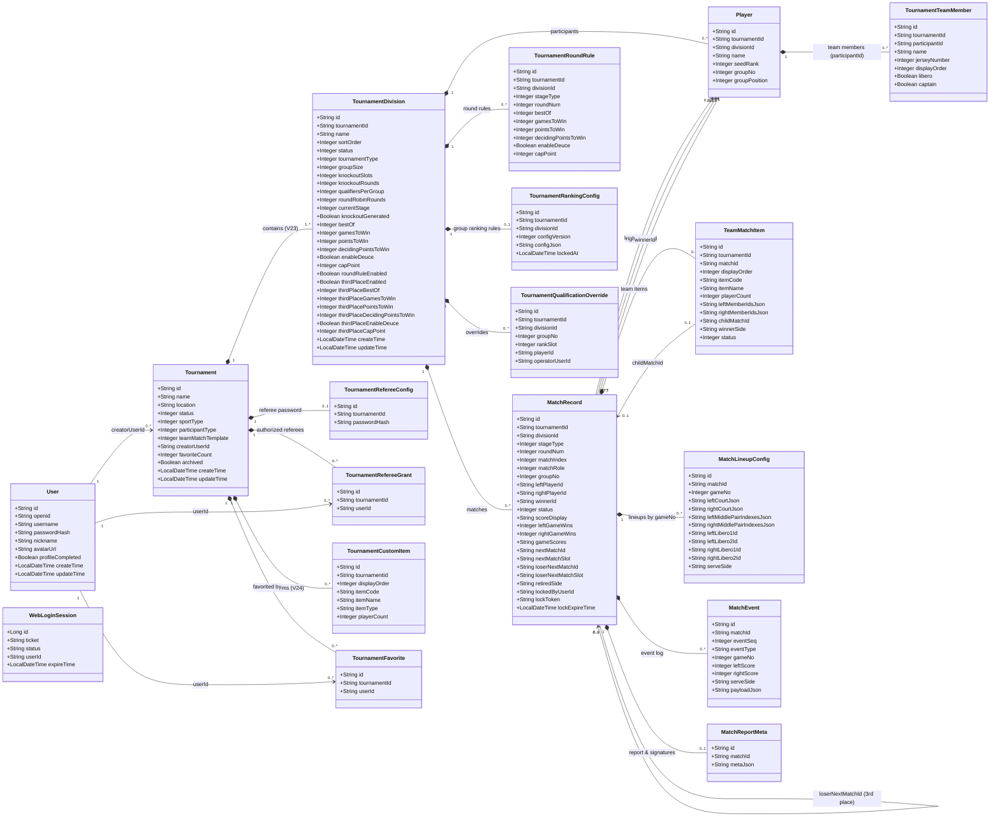
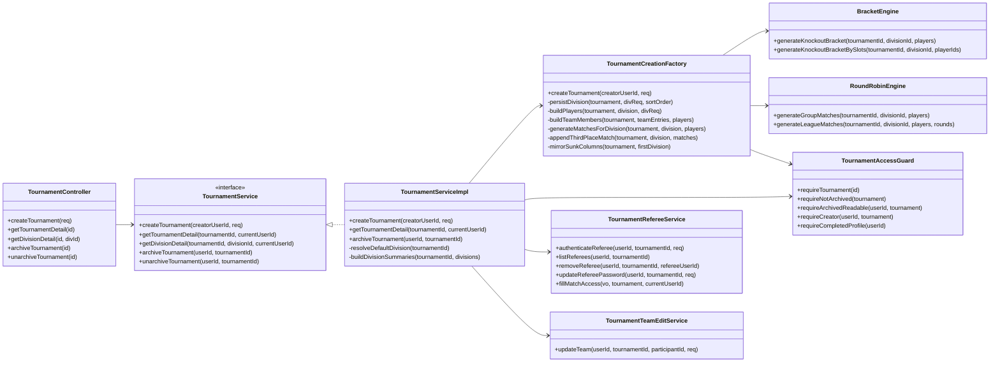
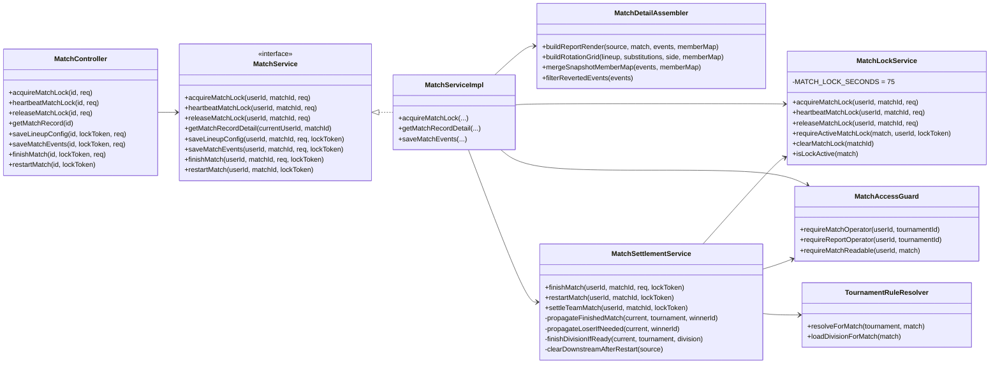
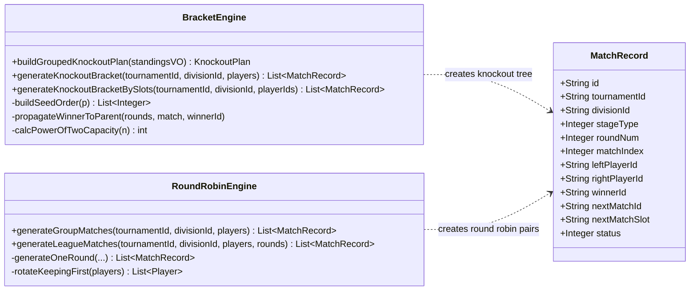
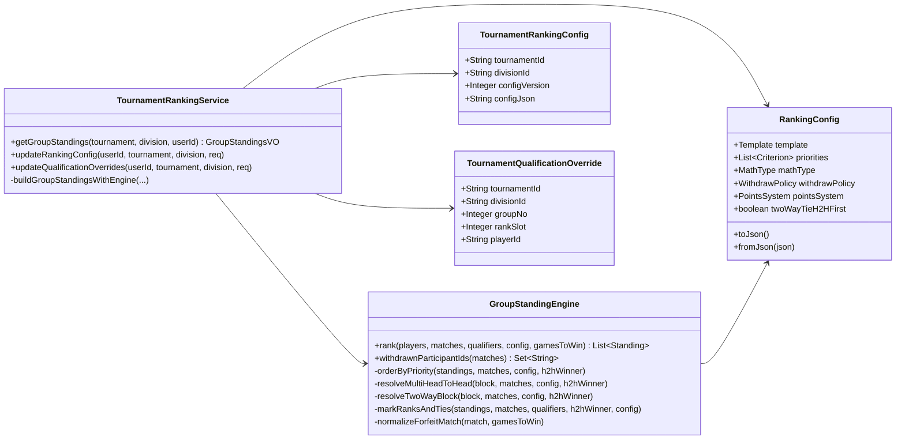
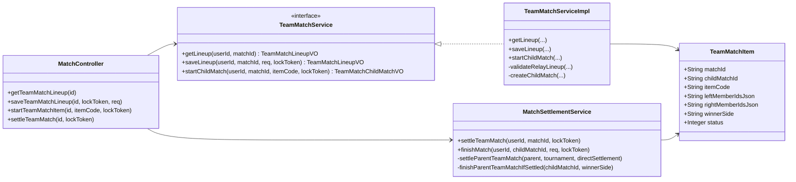
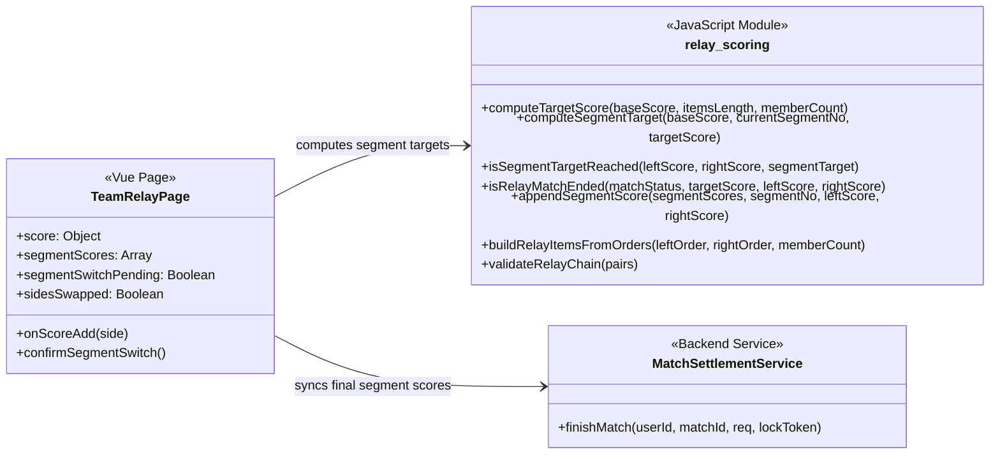
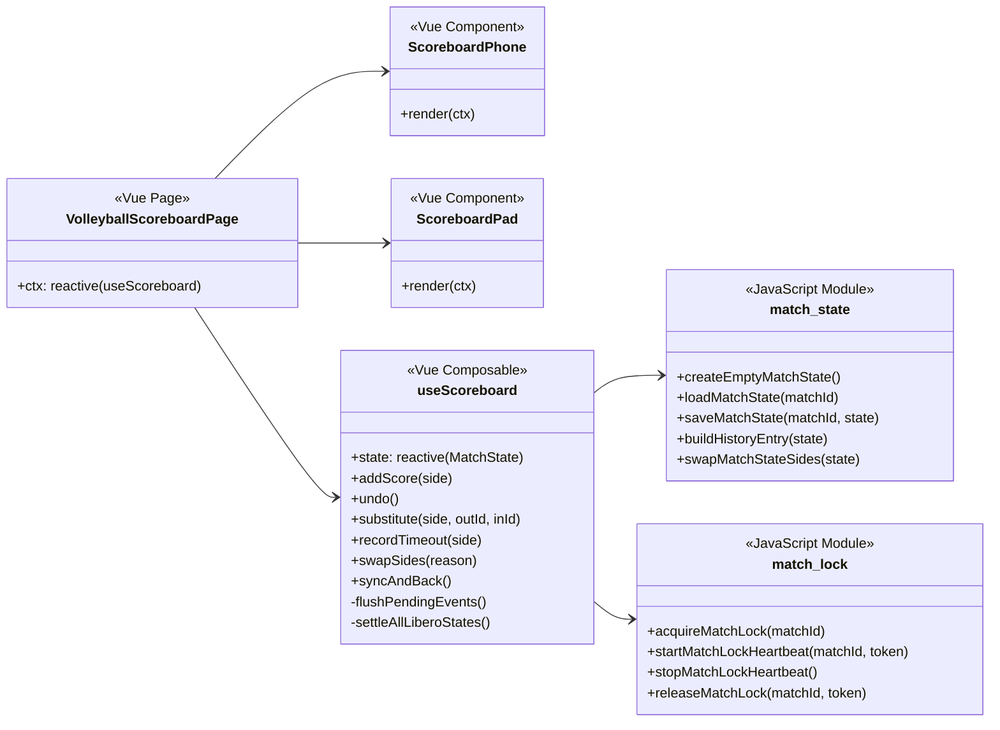
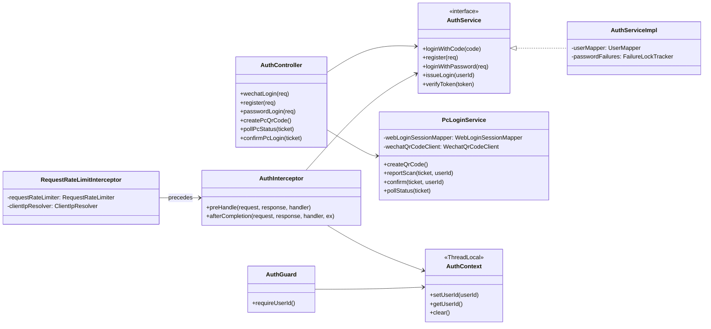
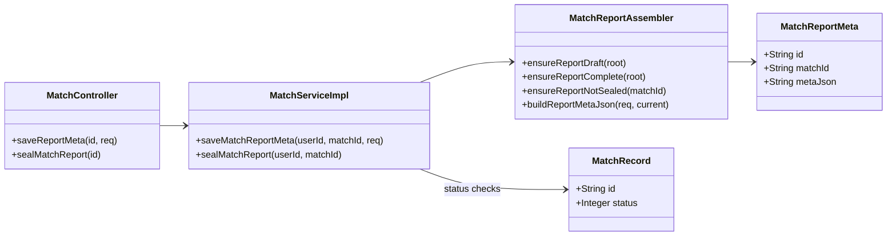

# 系统全景类图与领域架构设计文档

> **更新时间**：2026-09-28  
> **设计原则**：以最新的数据库版本（V23 组别层级下沉改造、V24 自定义团体赛项、V26 编码对齐）与现有 Spring Boot + uni-app / admin-web 生产代码为基准。  
> **阅读建议**：本文档按功能领域划分为 10 个独立视图，使用 Mermaid 规范渲染，全面展示系统核心实体、接口、服务层与组件协作依赖。

---

## 目录
1. [全局核心领域模型图 (Domain Model)](#1-全局核心领域模型图-domain-model)
2. [赛事创建与组别生命周期架构图 (Tournament & Division)](#2-赛事创建与组别生命周期架构图-tournament--division)
3. [比赛记分、执裁锁与结算链路图 (Match & Settlement)](#3-比赛记分执裁锁与结算链路图-match--settlement)
4. [赛制编排引擎与种子/轮空架构图 (Tournament Engines)](#4-赛制编排引擎与种子轮空架构图-tournament-engines)
5. [小组排名引擎与多队破平策略图 (Group Standing & Tie-break Engine)](#5-小组排名引擎与多队破平策略图-group-standing--tie-break-engine)
6. [团体赛子项布阵与子比赛流向图 (Team Match & Lineup)](#6-团体赛子项布阵与子比赛流向图-team-match--lineup)
7. [追分接力赛实时赛段驱动图 (Relay Scoring Engine)](#7-追分接力赛实时赛段驱动图-relay-scoring-engine)
8. [排球记分前端状态机与协作图 (Volleyball State Composable)](#8-排球记分前端状态机与协作图-volleyball-state-composable)
9. [用户认证、PC 扫码与权限管理图 (Auth, User & PC Login)](#9-用户认证pc-扫码与权限管理图-auth-user--pc-login)
10. [战报元数据与电子签名封签图 (Match Report & Signatures)](#10-战报元数据与电子签名封签图-match-report--signatures)

---

## 1. 全局核心领域模型图 (Domain Model)

展示系统的核心业务实体（Entity）以及实体之间的聚合、关联、外键与槽位指针关系：

---

## 2. 赛事创建与组别生命周期架构图 (Tournament & Division)

展示从 Controller 到 Service，再通过工厂落库组别、赛制规则并调用引擎编排赛程的全景图：

---

## 3. 比赛记分、执裁锁与结算链路图 (Match & Settlement)

展示单场比赛从执裁申请锁、心跳维持、保存事件、阵容更新到结算、级联晋级槽位传播的类调用关系：

---

## 4. 赛制编排引擎与种子/轮空架构图 (Tournament Engines)

展示对阵生成的数学分治算法与圆周旋转算法：

---

## 5. 小组排名引擎与多队破平策略图 (Group Standing & Tie-break Engine)

展示循环赛积分计算、退赛清洗策略、相互胜负小联赛破平与资格覆盖：

---

## 6. 团体赛子项布阵与子比赛流向图 (Team Match & Lineup)

展示多项团体赛（苏杯五项、自定义 3/5/7 项）中父场、单项对阵及子场的流转：

---

## 7. 追分接力赛实时赛段驱动图 (Relay Scoring Engine)

展示接力赛（Relay Chase）在单父场内的赛段目标推导与搭档轮替：

---

## 8. 排球记分前端状态机与协作图 (Volleyball State Composable)

展示排球记分板中 UI 响应层、状态机驱动层、本地恢复与执裁锁的心跳协同：

---

## 9. 用户认证、PC 扫码与权限管理图 (Auth, User & PC Login)

展示全站双端鉴权、ThreadLocal 上下文传递、限流与 PC 扫码状态机：

---

## 10. 战报元数据与电子签名封签图 (Match Report & Signatures)

展示赛后战报签章、多裁判模式完整性校验与不可逆封存：

---
*本文档全面覆盖当前 Scoring 系统各层代码结构，反映了 V23 组别下沉以来的最新架构现状。*
